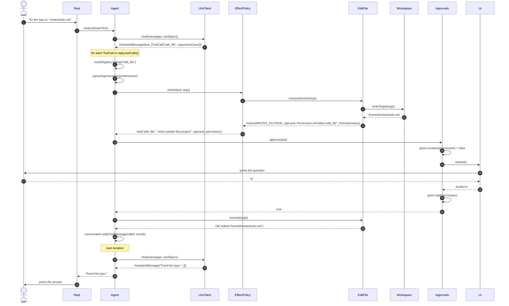

# run_command — design

**Date:** 2026-08-27
**Status:** approved, pending implementation plan
**Issue:** [#17](https://github.com/bbossola/konacode/issues/17)

## Problem

konacode reads files, edits files and deletes files. It cannot run a command. The model therefore
cannot compile the code it writes, cannot run the tests, and cannot read the output of `git diff`.

This is piece B of three.

| Piece | What it adds |
|---|---|
| A, done | The approval seam. konacode asks before it reads or writes outside your project. |
| **B, this design** | `run_command`, and the seam change that a command needs. |
| C | A judge that answers run or ask, so the routine questions stop. |

## Two parts

Part 1 changes the approval seam. Part 2 adds the tool. Part 1 comes first, because a command
breaks the shape that piece A left behind.

## Part 1 — the seam

### The problem with the shape today

Today a tool answers one enum value, and the policy builds the rest of the question.

```java
Effect effect(JsonNode args);                                  // Tool
record Ask(String action, String subject, Path alwaysFolder)   // Decision
```

The policy therefore holds a `Workspace`, and it reads the argument key `"path"` to find the
subject. Two facts break this for a command.

1. **A command has no path.** The policy would need a second rule for a second argument name.
   The policy would then know the argument names of every tool.
2. **A folder cannot describe what `always` covers for a command.** The user says always to
   `mvn test`, and not to a folder.

### The fact a tool states

`Tool` answers with one record, and not with one enum value.

```java
Action computeAction(JsonNode args);

public record Action(Effect effect, String operand, Optional<Permission> permission) {}
```

- **`effect`** — what this call does. The enum of piece A, unchanged.
- **`operand`** — what the call acts on, in words, for the screen. A path for a file tool. The
  command line for `run_command`.
- **`permission`** — what a standing yes would cover. **Empty means konacode offers no `always`
  for this call.**

The tool fills all three, because the tool owns its argument names and its `Workspace`.

### The permission

A permission is a standing decision that the user gave. It is a value, and konacode compares two
permissions for equality. konacode never examines one.

```java
public sealed interface Permission {

    String inWords();

    record InFolder(String toolName, Path folder) implements Permission {
        @Override public String inWords() { return toolName + " in " + folder; }
    }

    record ExactCommand(String toolName, String command) implements Permission {
        @Override public String inWords() { return toolName + " exactly: " + command; }
    }
}
```

A record gives equality, and equality is the whole lookup. Two kinds are never equal, so a folder
permission can never cover a command. The interface is sealed, so a third kind is a compile error
at `inWords` and at no other place.

### The question

```java
public sealed interface Decision {
    record Allow() implements Decision {}
    record Deny(String reason) implements Decision {}
    record Ask(String toolName, String intent, String operand, Optional<Permission> permission)
            implements Decision {}
}
```

`Ask` is a question, written and not yet put. It holds the words to show and the choices to offer.

- **`toolName`** — the tool that wants to act. The question begins with it, and it is present even
  when the permission is empty.
- **`intent`** — the sentence, for example `"write outside this project"`.
- **`operand`** — what the call acts on.
- **`permission`** — what a standing yes covers. Empty means the user may answer once only.

`Deny` keeps no producer. It waits for piece C.

### How the policy makes the question

```java
public Decision check(Tool tool, JsonNode args) {
    Action action = tool.computeAction(args);
    return switch (action.effect()) {
        case READS_INSIDE, WRITES_INSIDE -> Decision.allow();
        case READS_OUTSIDE  -> ask("read outside this project", tool, action);
        case WRITES_OUTSIDE -> ask("write outside this project", tool, action);
        case RUNS           -> ask("run a command", tool, action);
    };
}

private static Decision ask(String intent, Tool tool, Action action) {
    return new Decision.Ask(tool.name(), intent, action.operand(), action.permission());
}
```

| `Action` field | `Ask` field | What happens |
|---|---|---|
| `effect` | — | It chooses the branch, and it does not survive. |
| `operand` | `operand` | Copied, unchanged. |
| `permission` | `permission` | Copied, unchanged. |
| — | `intent` | The policy adds the words. |
| — | `toolName` | The policy copies `tool.name()`. |

The policy trades the effect for a sentence, and it passes the rest through.

The words belong to the policy. "Outside this project" is not a fact about the call. It is
`EffectPolicy` that names its own boundary. A policy with another boundary writes another sentence.
A tool must not know which policy is in use.

`EffectPolicy` therefore holds no `Workspace`, and it becomes stateless.

### The memory

`Approvals` holds a `Set<Permission>`. It tests `contains` before it asks. It adds on `ALWAYS`.

```java
public boolean approve(Decision.Ask ask);
```

The `Ask` carries the tool name, so the loop passes one value only.

### What each tool answers

| Tool | effect | operand | permission |
|---|---|---|---|
| `read_file`, inside | `READS_INSIDE` | the path | — (never asked) |
| `read_file`, outside | `READS_OUTSIDE` | the real path | `InFolder`, the real folder |
| `edit_file`, outside | `WRITES_OUTSIDE` | the entry path | `InFolder`, the folder of the entry |
| a broken link | `READS_OUTSIDE` | the path as written | **empty** |
| `run_command`, plain | `RUNS` | the command line | `ExactCommand`, the exact line |
| `run_command`, expands | `RUNS` | the command line | **empty** |

The two empty rows are the point of the change. A call reaches nothing, or a line means something
else on the next call. In each case no standing permission can be honest.

### One turn, with the first edit outside the project



The second edit of the same file repeats every step up to `approve`. There `contains` answers true,
`Ui` is not called, and the tool runs. The policy is stateless and it repeats its work on every
call. One `Set.contains` is the whole difference.

## Part 2 — the tool

### The shape

```json
{ "command": "mvn -q test" }
```

One argument, and it is a shell line. konacode runs it with `sh -c`.

An argument list was the alternative. A list needs no shell, and it cannot expand. It also cannot
pipe, and it cannot use `&&`. The model writes shell lines, because every example it read is a
shell line. A list would make the model write `sh -c` inside the list, and konacode would gain
nothing and lose the ability to read what runs.

### The effect

`RUNS`, always. A command inside the project can reach any file on the disk, so the launch
directory decides nothing here.

### Expansion, and what `always` may cover

konacode reads the command line for these characters:

```
$   `   *   ?   [   ~
```

Each one makes the line mean something else on another day. `rm *.log` removes a different set of
files each time it runs. A standing permission for that line is a lie.

A line with one of these characters therefore gives **no permission**. konacode asks on every call,
and the screen shows `y` and `n` only.

A line with none of them gives `ExactCommand`. The user may answer `a`, and konacode remembers the
exact line, character for character.

`|`, `&&`, `||` and `;` need no rule. They join commands, and the line still means the same thing
on the next day.

### What the user sees

```
run_command wants to run a command.

  mvn -q test

  y  run it once
  n  refuse
  a  always, for run_command exactly: mvn -q test
```

A line that expands shows `y` and `n`, and no `a`.

### Stopping a command

Two things stop a command that does not return.

- **`esc`.** `run_command` answers true to `stopsOnInterrupt`, so the loop arms `Cancellation`
  around `execute`. The tool destroys the process tree and reports that the user stopped it.
- **A timeout.** The default is 600 seconds. The property `konacode.command.timeoutSeconds` changes
  it. A wrong value prints one line and exits 1, which is the rule for every property.

### The output

The tool caps the output at 100 KB, in the way `read_file` caps a file. The cap keeps the first
part and the last part, and it writes one line between them:

```
<removed 4213 lines, 431201 bytes from the middle>
```

The angle brackets put this line in the family of `<error>`, which is the one token konacode
already uses to tell the model that konacode speaks, and not the tool. A build tool prints its own
truncation notice as prose, so prose here would be ambiguous.

A build prints its error at the end, and its command line at the start. A cap that kept only the
first part would remove the answer.

`stdout` and `stderr` are merged, in the order the process wrote them. The model reads one stream,
in the way a human reads a terminal.

**A command that outlives its shell may lose its output.** konacode reads the pipe on one thread
while the command runs. When the shell exits, the JDK keeps the bytes already in the pipe and
reports the end of the stream, so a background job that writes after that point is not seen. When
konacode can detect the short read it adds `<output may be incomplete: a background process still
holds it open>`, and sometimes it cannot detect it. A temporary file would remove the race and let
one runaway command fill the disk, so konacode keeps the pipe and the tool description tells the
model to background a job only when it does not need what the job prints.

### The exit code

The result is `Ok`, and the text ends with the exit code.

```
<exit 1>
```

A non-zero exit is not a tool failure. konacode ran the command, and the command answered. The
model must read that answer and act on it. `Err` is for a command konacode could not run at all: a
timeout, a stop, or a shell that did not start.

### The working directory

The root of the workspace. The model does not choose it. A model that needs another directory
writes `cd` in the line, and the line then shows that to the user.

### Standard input

Closed. A command that waits for input then fails at once, instead of holding the turn until the
timeout.

## The plain interface

`PlainUi` keeps `AllowAllPolicy` as its default, so a piped session runs a command with no
question. This is the choice piece A already made for a write outside the project. A pipe has no
user to answer.

## Rejected alternatives

**An argument list instead of a shell line.** See "The shape".

**A list of commands that are always allowed,** for example `git status` and `ls`. That list is a
judgement, and a judgement is piece C. A list in the tool would put the decision in the tool.

**`always` for a line that expands.** The user asked for this and then withdrew it. `rm *.log`
approved once would remove another set of files later, and the user would not see the second
removal.

**A `never` answer.** Out of scope, in the way piece A left it.

**A timeout that the model sets.** The model would raise it to escape the limit. The user owns the
property.

**Keeping the first part of the output only.** A build reports its failure at the end.

## Out of scope

The judge and `JudgedPolicy`, which are piece C. A command that runs in the background. An
environment variable that the model sets. A permission written to disk.

## Tests

All offline, and a temporary folder holds every path. No test waits for a long process: konacode
stops each one, or the deadline stops it.

**Part 1**

- Each of the four file tools answers an `Action` with the right effect, operand and permission.
- A broken link gives an empty permission.
- `EffectPolicy` turns each of the five effects into `Allow` or `Ask`, and copies the operand and
  the permission unchanged.
- `EffectPolicy` holds no state, and two calls give equal answers.
- `Approvals` asks once, remembers `ALWAYS`, and asks again for another permission.
- An `InFolder` permission never covers an `ExactCommand` permission.
- `Agent` turns a refusal into an `Err` and keeps the turn alive.

**Part 2**

- A command that succeeds gives `Ok` and reports `exit 0`.
- A command that fails gives `Ok` and reports the exit code.
- A line with each of the six characters gives an empty permission.
- A line with `|`, `&&` and `;` gives an `ExactCommand` permission.
- The output cap keeps the first part and the last part, and names what it removed.
- The cap reports a removed part that holds no newline, and the line count is then zero.
- A timeout gives `Err`, and the process is gone.
- A stop gives `Err`, and the process is gone.
- `stopsOnInterrupt` answers true.
- A bad `konacode.command.timeoutSeconds` fails loudly.
